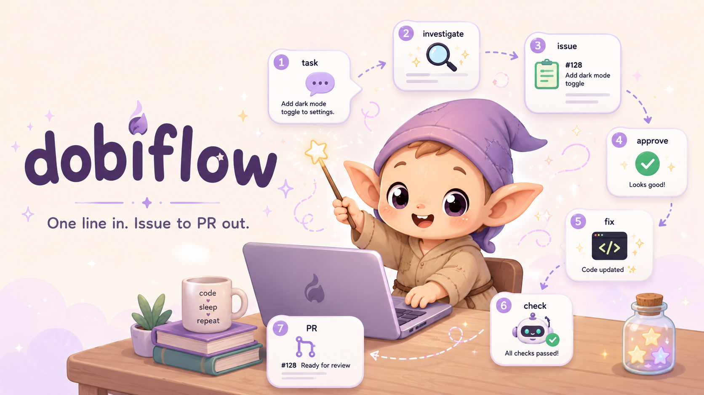

# 🧦 dobiflow

<!-- 여기에 히어로 스크린샷: /work 한 줄 → 이슈 → 승인 → PR 흐름이 한 화면에 담긴 터미널 캡처 -->
<!--  -->

<!-- 여기에 demo.gif: 실제로 도비가 이슈 만들고 → 승인받고 → 고치고 → PR 올리는 30초 클립 -->
<!--  -->

> **주인님은 한 줄만 던지세요. 나머지는 도비가 다 할게요. 그리고 PR을 올리면… 도비는 자유예요.**

[English README](README.md)


이슈 하나, 작업 하나를 한 줄로 던지면 — 도비가 원인을 파악하고, GitHub 이슈를 만들고,
**주인님이 허락하면** 브랜치를 따서 고치고, 스스로를 검사하고, PR까지 올립니다.
전부 **주인님 컴퓨터 안에서** 돌아가요. GitHub Actions 안 써요. Claude Code / Codex 구독으로
굴러가니까 **API 추가 비용은 0원**이에요.

도비는 시키는 일만 하는 착한 요정이라서, **허락 없이는 코드를 절대 건드리지 않아요.**

```text
> /work 대시보드 로고 눌렀는데 아무 데도 안 감

  🧦 도비가 이슈를 읽었어요… 버그네요. 원인을 찾아볼게요, 주인님.

  ✓ 원인 찾았어요       Header.tsx:42 — <Logo />에 onClick/href가 없어요
  ✓ 이슈 만들었어요      github.com/you/app/issues/128
  ✋ 도비는 여기서 멈춰요  레포·base 확인했어요. 고쳐도 될까요, 주인님?

> ㅇㅋ

  🧦 도비가 고칠게요…
  🔁 구현 → 린트·테스트 → 자가체크 (도비가 스스로를 검사해요)
     └ code-reviewer + policy-checker: 지적 없음 ✓
  ✓ 전부 초록불이에요     PR 올렸어요 → github.com/you/app/pull/129

  🧦 도비는… 자유예요!
```

## 설치

### Claude Code (플러그인)

```bash
# 마켓플레이스 등록 후 설치
/plugin marketplace add NariP/dobiflow
/plugin install dobiflow@dobiflow
```

로컬에서 바로 테스트:
```bash
claude --plugin-dir <클론 경로>
```

### Claude Code + Codex CLI (스크립트)

클론 후 `install.sh` 하나면 설치된 CLI(claude/codex)를 자동 감지해 각 홈에 설치해요.

```bash
git clone https://github.com/NariP/dobiflow
cd dobiflow
./install.sh              # claude·codex 둘 다 (감지된 것만)
# ./install.sh --claude-only / --codex-only / --link / --dry-run
```

> `--link`는 복사 대신 심링크로 설치해요 — 이후엔 `git pull`(또는 로컬 수정)만으로 즉시 반영,
> 재설치 불필요. 클론을 계속 둘 머신에서만 쓰세요 (클론을 지우면 설치가 깨져요).

| 대상 | 설치 위치 |
|------|----------|
| Claude | `~/.claude/skills/*`, `~/.claude/agents/*.md` |
| Codex | `~/.agents/skills/*` + `~/.codex/skills/*` (버전 호환), `~/.codex/agents/*.toml` |

> Codex에서 Serena LSP를 쓰려면 `~/.codex/config.toml`에 `[mcp_servers.serena]`를 등록하세요(선택 — 없으면 grep으로 동작).

## 빠른 시작

```text
1.  /triage-init      ← 새 프로젝트에서 딱 1번 (도비가 설정을 자동으로 만들어요)
2.  /work <할 일>      ← 평소엔 이것만. 버그든 기능이든 던지면 도비가 알아서 분류해요
3.  "ㅇㅋ"             ← 도비가 만든 이슈/설계 보고 허락하면 → PR까지 도비가
```

까먹으면 `/triage-help` (도비가 다시 알려드려요).

## 혼자 할 때 vs 🧦 도비가 있을 때

|  | 그냥 혼자 | 🧦 **+ dobiflow** |
|---|---|---|
| 버그 한 줄 받으면 | 직접 파일 뒤져서 원인 찾기 | 도비가 원인·파일·줄까지 찾아서 이슈로 정리 |
| GitHub 이슈 | 손으로 제목·본문 씀 | 도비가 만들고 URL까지 보고 |
| 코드 건드리기 | 바로 손댐 | **허락받기 전엔 절대 안 건드림** (승인 게이트) |
| 구현 품질 | 다 짜고 나서 내가 리뷰 | 도비가 짜고, 다른 도비들이 검사하고, 지적 나오면 **스스로 다시 고침** |
| 도메인 정책 | 까먹기 쉬움 | policy-checker가 프로젝트 정책 위반 잡음 |
| 여러 레포 | 헷갈려서 엉뚱한 데 push | 이슈 보고 레포 판단, push 직전 레포 재확인 |
| 막혔을 때 | 억지로 어떻게든 마무리 | 도비가 **멈추고 정직하게 보고** ("도비는 못 하겠어요, 주인님") |
| 끝나면 | — | 도비는… 자유예요 🧦 |

## 명령어

| 명령 | 역할 |
|------|------|
| `/work` | 입구 — 입력 보고 버그/기능 분류 → 알맞은 워크플로우로 |
| `/triage-fix` | 버그 — 원인 파악 → 이슈 → 수정 → PR |
| `/task-run` | 기능/개선/리팩토링 — 설계 → 이슈 → 구현 → PR (큰 작업은 plan mode) |
| `/triage-status` | 열린 이슈·진행 PR 현황 조회 (조회만) |
| `/triage-init` | 새 프로젝트 설정 생성 (레포·린트·정책문서·커밋규칙 감지) |
| `/triage-help` | 사용법 안내 |

## 도비는 이렇게 일해요

```text
/work 대시보드 로고 눌렀는데 안 감
   ├─ 분류        → 버그 → triage-fix
   ├─ 원인 파악    → issue-triage (읽기 전용 — 도비는 함부로 안 고쳐요)
   ├─ GitHub 이슈  → 생성 + URL 보고
   ├─ ✋ 승인       → 레포·base 확인 후 "고쳐도 될까요, 주인님?"
   ├─ 구현 루프 🔁  → implementer 도비가 구현 + 린트·테스트
   │                 → policy-checker + code-reviewer (병렬로 도비를 검사)
   │                 → ❌ 지적 나오면 도비가 스스로 다시 고침 (최대 3회, 설정 가능)
   └─ PR          → 그린불 뜨면 커밋 + PR 생성 + 리뷰어 + URL
                     → 🧦 도비는 자유예요!
```

자세히는 [`docs/triage-workflow-guide.md`](docs/triage-workflow-guide.md).
왜 이렇게 설계했나 (페이즈별 패턴 지도): [`docs/architecture.md`](docs/architecture.md).

## 도비의 약속 (동작 조건과 한계 — 꼭 읽기)

dobiflow는 전부 **주인님 컴퓨터에서** 돌아가서, 도비가 지키는 규칙이 몇 개 있어요:

- **대상 레포가 로컬에 클론돼 있어야 해요.** 라우팅은 클론된 레포들 중에서 골라요.
  레포가 컴퓨터에 없으면 "클론 후 다시 시도"라고 안내하고 멈춰요 — 도비는 임의로 클론하지 않아요.
- **코드 작업(버그/기능/리팩)용이에요.** 분류는 제목이 아니라 **요구사항 전체**를 읽어요 —
  팝업·버튼·링크 연결·"다시 보지 않음" 같은 구현 항목이 하나라도 있으면, 제목이 "약관/정책"이라도
  기능 작업으로 봐요. **코드 작업이 전혀 없는** 순수 법무 텍스트·문서·운영만 범위 밖이고,
  섞여 있으면 나눠서(코드 부분은 진행, 비-코드 부분은 알림) 처리해요.
- **애매하면 도비가 물어봐요.** 어느 레포인지 애매하면 자동 진행 대신 물어봐요.
- **쓰기는 게이트를 통과해야 해요.** 이슈/PR 만들기 직전 대상 레포를 재확인하고
  (엉뚱한 데 올리는 것 방지), 코드를 건드리기 전 주인님 허락을 받아요.
  도비는 지금 로그인된 GitHub 계정을 그대로 써요 — 계정 전환은 도비 밖의 일이에요
  (예: `gitto` 같은 도구가 git 레벨에서 처리).

## 도비가 잘하는 것

- **Claude Code + Codex 둘 다** — 같은 워크플로우를 두 CLI에서 (스킬·서브에이전트·plan mode 네이티브 대응)
- **입력 자유** — 노션 링크 / 슬랙 링크 / 그냥 텍스트 다 받아요
- **승인 정지점** — 이슈는 만들되, 코드는 주인님이 "ㅇㅋ" 해야 손대요
- **멀티 레포** — 이슈 내용 보고 알맞은 레포 자동 판단 (애매하면 물어봐요)
- **프로젝트 룰 우선** — 커밋 규칙·정책·컨벤션을 그 프로젝트 것으로
- **구현 루프** — 구현은 implementer 도비, 검사는 리뷰 도비들이 맡아 지적이 나오면
  스스로 재구현. 그린이 될 때까지 돌되 한도를 넘기면 억지 PR 대신 멈추고 보고
- **자가체크 분리** — 도메인 정책 검사 + 일반 코드리뷰를 따로 (읽기 전용 도비들)
- **코드 탐색** — Serena LSP 있으면 심볼 단위 정밀, 없으면 grep 폴백

## 이벤트 훅 (선택)

도비가 일하는 동안 시점별로 훅이 발동해서 **주인님이 정의한 스크립트**를 실행해요 —
슬랙/텔레그램 알림, 로그, 진행 중 작업 수집(여러 세션·레포의 태스크를 외부 서비스로 모으기), 뭐든.

| 이벤트 | 시점 | 주요 환경변수 (공통: `DOBIFLOW_EVENT`, `DOBIFLOW_CWD`) |
|---|---|---|
| `issue-created` | GitHub 이슈 생성 직후 | `DOBIFLOW_URL`, `DOBIFLOW_COMMAND` |
| `pr-created` | GitHub PR 생성 직후 | `DOBIFLOW_URL`, `DOBIFLOW_COMMAND` |
| `work-started` | 구현 루프 진입 (도비 출근) | `DOBIFLOW_{SKILL,REPO,ISSUE,ISSUE_URL,BRANCH,TITLE}` |
| `iteration-completed` | 루프 매 반복 판정 직후 | `DOBIFLOW_{SKILL,REPO,ISSUE,ITERATION,VERDICT}` |
| `work-finished` | PR까지 완료 (🧦 도비는 자유!) | `DOBIFLOW_{SKILL,REPO,ISSUE,PR_URL,ITERATIONS}` |
| `work-stopped` | 막힘·max 소진으로 중단 | `DOBIFLOW_{SKILL,REPO,ISSUE,REASON}` |

실행 가능한 스크립트를 아래 위치에 두면 돼요(전역·프로젝트 둘 다 가능):

```text
~/.dobiflow/hooks/on-<이벤트>.sh                    # 전역 (모든 프로젝트)
<repo>/.claude/dobiflow-hooks/on-<이벤트>.sh        # 프로젝트별
```

- `issue-created`/`pr-created` — Claude Code 훅(PostToolUse)이 `gh` 명령을 감지해 자동 발동 (`jq` 필요).
- `work-*`/`iteration-*` — 작업 생명주기 이벤트. 스킬이 `~/.dobiflow/bin/dobiflow-emit`으로
  직접 발행해요 (install.sh가 설치 — 없으면 조용히 생략, Claude·Codex 공통).
- 템플릿은 `hooks/examples/` 참고. 훅이 실패해도 도비의 본 작업은 막히지 않아요.

## 의존성 (권장)

- **GitHub CLI (`gh`)** — 이슈/PR 생성. 인증 필요(`gh auth login`).
- **Serena MCP** (선택) — 심볼 단위 코드 탐색. 없으면 grep으로 동작.
  user 스코프 등록: `claude mcp add --scope user serena -- serena start-mcp-server --context claude-code`

## 라이선스

MIT

<sub>🧦 dobiflow의 "도비"는 이 프로젝트의 마스코트예요 — 허락받고 일하고, 끝나면 자유를 얻는 작은 집요정. 특정 작품과는 무관해요.</sub>
